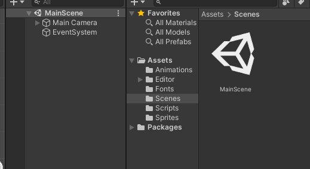
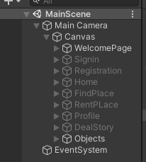
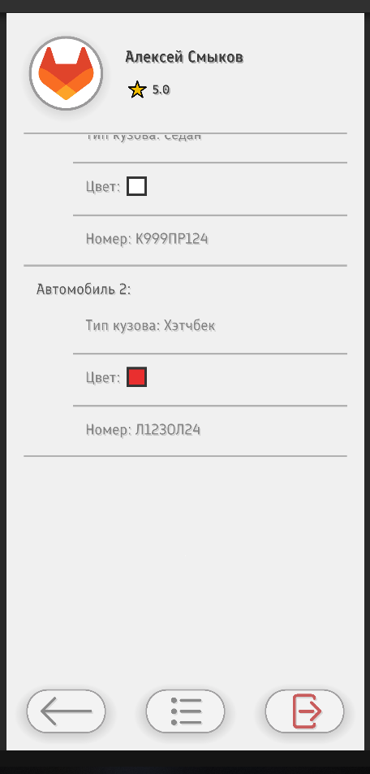
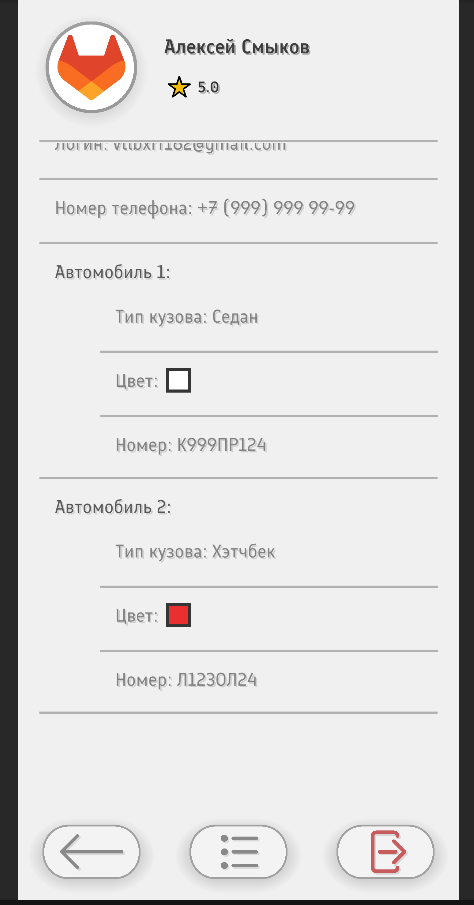
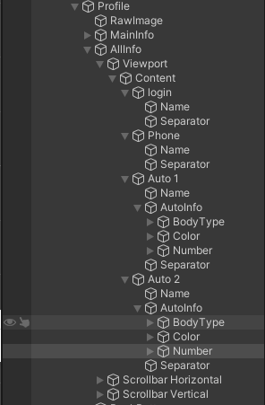
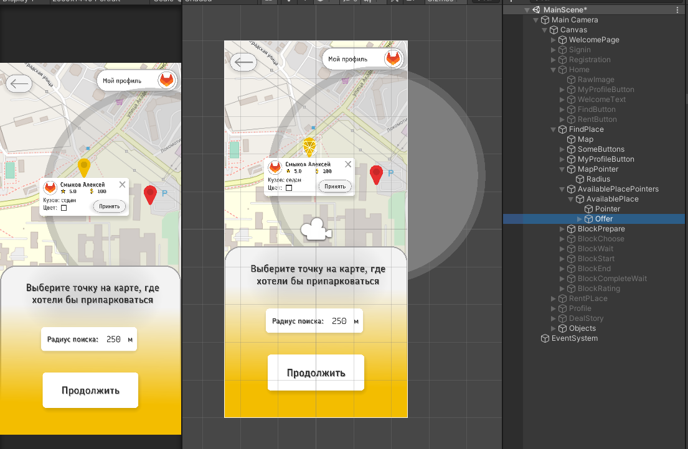
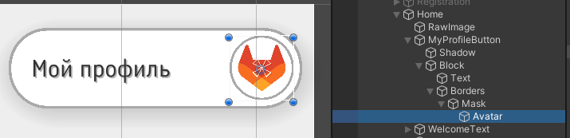
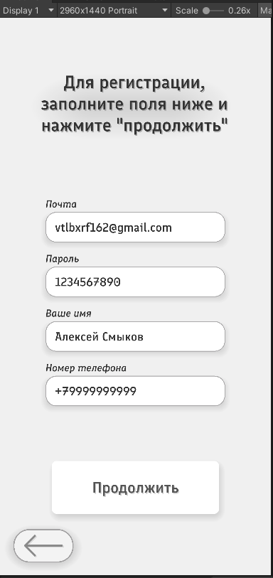
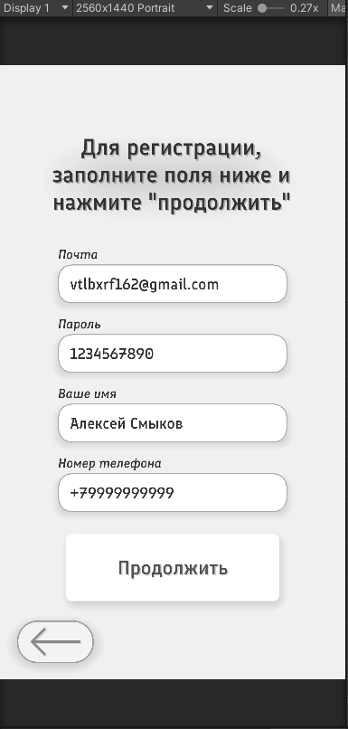

# About
## Project
Этот проект является учебным проектом по дисциплине "Разработка Мобильных Приложений". Проект находится в [Github](https://github.com/DiabloZX/Parking-Study), все новые версии, вся информация о проекте также находится там же. Само приложение разрабатывается на движке `Unity` версии `2020.3.26f1` на языке `C#`. Для создания спрайтов использовалось приложение `Aseprite`.

## App
Данное мобильное приложение создано с целью помочь владельцам авто в поиске парковочного места. 

Общий поток действий пользователей:
- Пользователь, который уже занял парковочное место, может создать предложение этого места, указав адрес и время, когда и где он освободит свое место. 
- Пользователь, который ищет парковочные места вблизи указанного места, может выбрать самое подходящее предложение о месте из предложенных системой и отправить владельцу места запрос на сделку. 
- Если же владелец места согласится на запрос, то будет создана сделка, которая будет вручную завершена пользователями после обмена парковочным местом.
- После завершения сделки, сдаваший место получает условные `бонусы` приложения от другого пользователя, которые занял место первого.

Также в приложении есть личный профиль, рейтинг, история сделок и возможность указать точные данные о своих автомобилях.

## Author
Проект выполнен студентом Сибирского Федерального Университета Института Космических и Информационных Технологий группы `КИ20-17/1Б` `Смыковым Алексеем`.

Мой [Github](https://github.com/DiabloZX)

# Install project to your computer
Чтобы открыть проект на вашем компьютере, необходимо выполнить следующие вещи:
- Стянуть репозиторий к себе
- Установить нужную версию Unity (`2020.3.26f1`), например, через UnityHub.
- Открыть проект как существующий, указав папку Unity-проекта как корневую директорию проекта

# Current project status
В данный момент, проект находится на стадии созданного кликабельного макета с заглушками и без кода. Проект выполняет задание `Практической работы №2`, имея рабочий макет, который можно запустить через `apk-файл`.

# Download & Use
Скачать последнюю версию вы можете по следующим ссылкам:
- [apks](https://github.com/DiabloZX/Parking-Study/tree/Latest/Versions)
- [Release](https://github.com/DiabloZX/Parking-Study/releases/tag/Latest)
- [Source code zip](https://github.com/DiabloZX/Parking-Study/archive/refs/tags/Latest.zip)
- [Source code tar.gz](https://github.com/DiabloZX/Parking-Study/archive/refs/tags/Latest.tar.gz)

# Project objects examples
Ниже будут представлены примеры некоторых элементов, объектов, из которых состоит проект для мгновенного просмотра внутренней работы проекта без необходимости установки его себе.

### Весь проект состоит из 1 сцены: 

___
### Сцена состоит из нескольких экранов: 
- Приветственная страница
- Страница входа
- Страница регистрации
- Домашняя страница 
- Страница поиска места
- Страница сдачи места
- Профиль пользователя
- Страница истории сделок

___
### Пример использования элемента Scroll view: 

___
### Пример экрана с картой: 

___
### Пример использования маски для округления квадратных изображения аватара пользователя: 

___
### Пример использование якорей (Anchers) на элементах для верстки на разных размерах экранов: 

